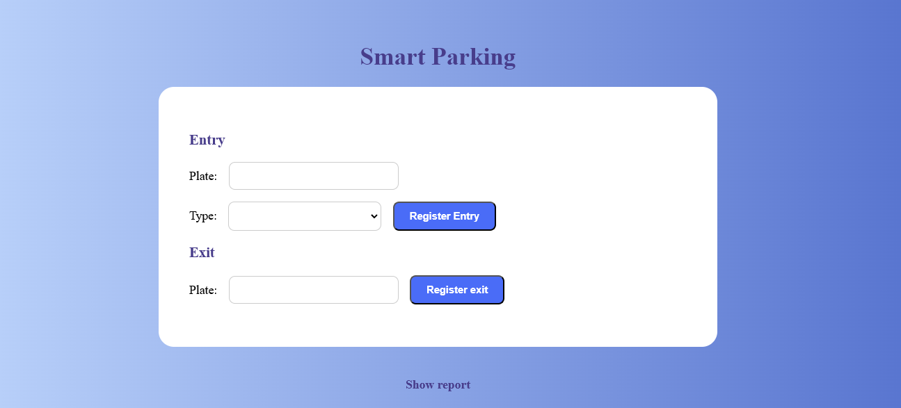
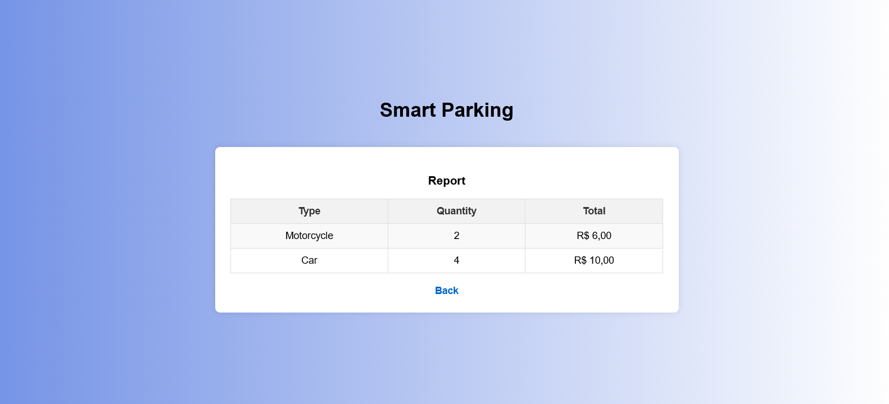
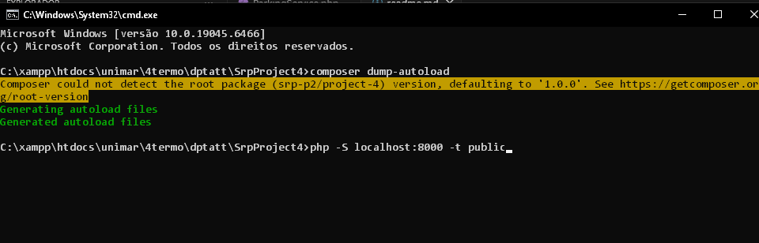
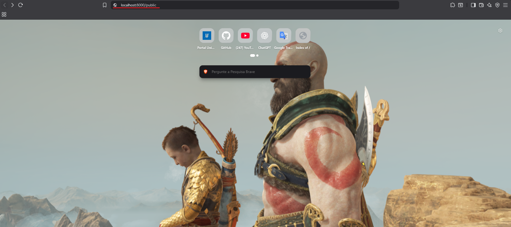
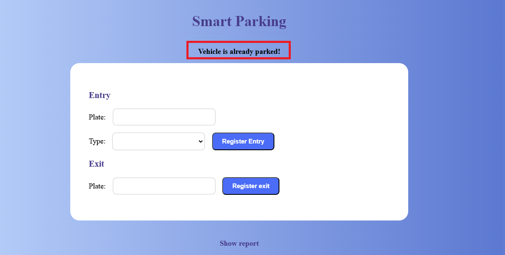
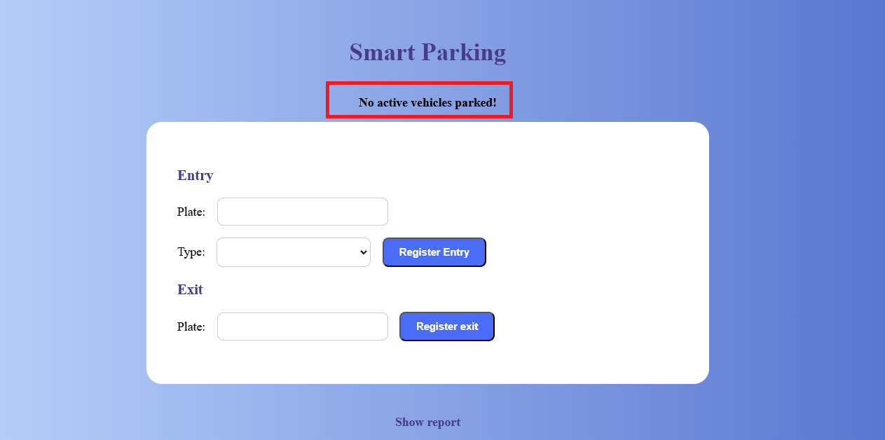

## Projeto final de aplicação dos conceitos vistos em sala, foi desenvolvido seguindo as recomendações padrão do PHP, utilizando os princípios SOLID, código limpo e outras recomendações também (DRY e KISS). Aqui, encontraremos a versão PHP 8.3.25, gerenciador composer e persistência de dados em SQLite.



## Integrantes        |   RA 
- Igor Ramos          | 1992632
- Guilherme Vicente   | 1992017
- João Pedro Messias  | 1993720

## Estruturação das pastas 
```
SRP PROJECT4
├── images/
│   └──imagens_do_projeto
├── public/
│   └── index.php
├── src/
│   ├── Application/
│   │   └── ParkingService.php
│   ├── Domain/
│   │   ├── Entity/
│   │   │   ├── Car.php
│   │   │   ├── Motorcycle.php
│   │   │   ├── Truck.php
│   │   │   └── Vehicle.php
│   │   ├── Interface/
│   │   │   ├── ParkingRepository.php
│   │   │   ├── PricingRule.php
│   │   │   └── VehicleRepository.php
│   │   └── Service/
│   │       ├── CarPricing.php
│   │       ├── MotorcyclePricing.php
│   │       └── TruckPricing.php
│   └── Infra/
│       ├── Database/
│       │   └── Connection.php
│       └── Repository/
│           ├── SQLiteParkingRepository.php
│           └── SQLiteVehicleRepository.php
├── vendor/
│   └── autoload.php
├── composer.json
├── database.sqlite
└── Readme.md
```

## Requisitos para rodar:
- PHP versão 8.0 ou superior e o gerenciador de dependências Composer

## Recursos do projeto

- Tipos de Veículos: Suporte para Carro, Moto e Caminhão.
- Camada de Domínio: Entidades (Car, Motorcycle, etc.), Interfaces de Repositório e regras de Preço.
- Camada de Aplicação: O serviço principal (ParkingService.php) que orquestra as operações.
- Infraestrutura: Implementação de Repositórios usando SQLite e classe de conexão com o Banco de Dados.
- Sistema de Preços: Regras de preço separadas para cada tipo de veículo.



## Como rodar o projeto

- No terminal, rode o comando composer install.
- Após isso, escreva também php -S localhost:8000 (porta padrão) -t public.


- Abra o navegador e coloque na url http://localhost:8000/public -> pasta raíz onde o arquivo index.php é carregado.


- Quando acessar, inserir os dados conforme os formulários pedem (placa do veículo e tipo de veículo) e registrar entrada/saída.  

##  Casos de uso

1- Cadastrar uma placa de veíuclo já préviamente listada, mensagem de erro retornada informando que o veículo já está estacionado.


2- Pesquisar uma placa de veículo que não foi listada ainda, mensagem de erro retornada informando que não existe esse veículo estacionado.


